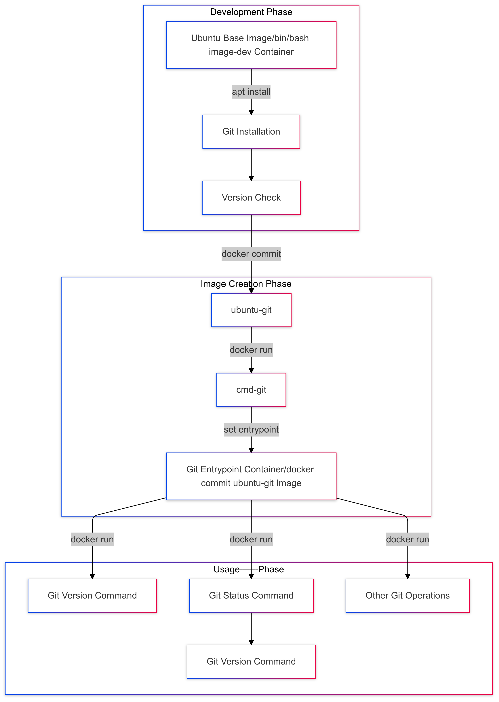

# 🐳 Docker-Ubuntu Git Integration

[](https://github.com/TheToriqul/docker-ubuntu-git)
[](https://github.com/TheToriqul/docker-ubuntu-git/stargazers)


## 📋 Project Overview

This project demonstrates advanced Docker containerization techniques by creating a customized Ubuntu environment with Git integration. Through this implementation, I've developed a streamlined solution for running Git operations in containers, featuring optimized entrypoint configurations and efficient image management practices.

## 🎯 Key Objectives

- Create a containerized Git environment using Ubuntu as the base image
- Implement proper Docker image versioning and commit strategies
- Configure container entrypoints for optimized Git operations
- Establish efficient container cleanup practices
- Demonstrate practical Docker workflow management

## 🏗️ Project Architecture

The project implements a multi-stage container development process, illustrated in the following diagram:

<figure >
  <p align="center">
      
      <p align="center">Project Architecture</p> 
  </p>
</figure>

## 💻 Technical Stack

- Frontend: N/A
- Backend: 
  - Docker Engine
  - Ubuntu Latest Image
  - Git 2.43.0
- DevOps:
  - Docker Container Management
  - Image Versioning
  - Entrypoint Configuration

## 🚀 Getting Started

<details>
<summary>🐳 Prerequisites</summary>

- Docker Engine installed and running
- Basic understanding of container operations
- Terminal/Command-line interface access
</details>

<details>
<summary>⚙️ Installation</summary>

1. Clone the repository:
   ```bash
   git clone https://github.com/TheToriqul/docker-ubuntu-git.git
   ```
2. Navigate to the project directory:
   ```bash
   cd docker-ubuntu-git
   ```
</details>

<details>
<summary>🎮 Usage</summary>

1. Build the initial container:
   ```bash
   docker run -it --name image-dev ubuntu:latest /bin/bash
   ```
2. Install Git in container:
   ```bash
   apt-get update && apt-get install -y git
   ```
3. Verify installation:
   ```bash
   git --version
   ```

For detailed commands and explanations, refer to the [reference-commands.md](reference-commands.md) file.
</details>

## 💡 Key Learnings

### Technical Mastery:
1. Docker container lifecycle management
2. Image commit and versioning strategies
3. Entrypoint configuration optimization
4. Container resource management
5. Git integration in containerized environments

### Professional Development:
1. Infrastructure as Code practices
2. Container optimization techniques
3. Docker best practices
4. Documentation-driven development
5. Efficient workflow management

### 🔄 Future Enhancements

<details>
<summary>View Planned Improvements</summary>

1. Multi-architecture image support
2. CI/CD pipeline integration
3. Custom Git configuration templates
4. Volume mounting optimization
5. Network isolation improvements
6. Performance optimization strategies
</details>

## 🙌 Contribution

Contributions are welcome! Feel free to [open an issue](https://github.com/TheToriqul/docker-ubuntu-git/issues) or submit a [pull request](https://github.com/TheToriqul/docker-ubuntu-git/pulls) to suggest improvements or add features.

## 📧 Connect with Me

- 📧 Email: toriqul.int@gmail.com
- 📱 Phone: +65 8936 7705, +8801765 939006
- 🌐 LinkedIn: [@TheToriqul](https://www.linkedin.com/in/thetoriqul/)
- 🐙 GitHub: [@TheToriqul](https://github.com/TheToriqul)
- 🌍 Portfolio: [TheToriqul.com](https://thetoriqul.com)

Let's connect and discuss containerization and DevOps!

## 👏 Acknowledgments

- [Poridhi for providing comprehensive labs and inspiring this project](https://poridhi.io/)
- Docker community for excellent documentation
- Open-source contributors who inspire continuous learning

Thank you for exploring this project! Feel free to star ⭐ the repository if you found it useful. Happy containerization! 🚀